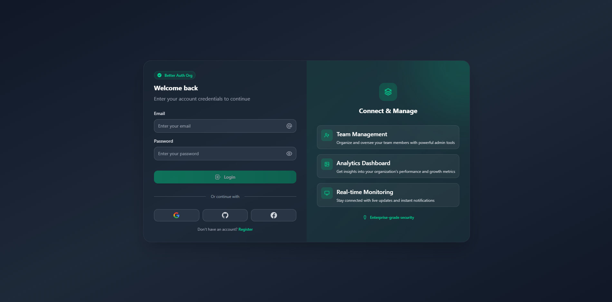
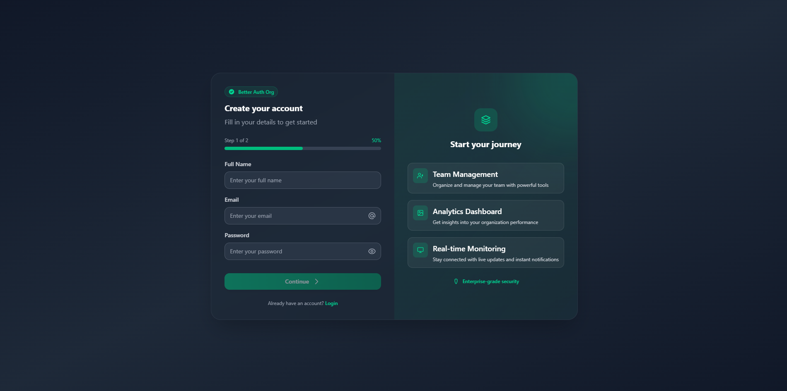
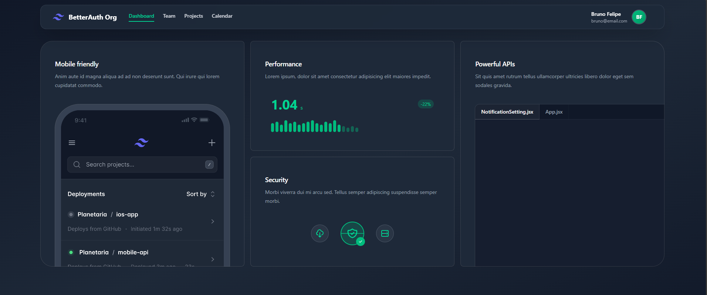
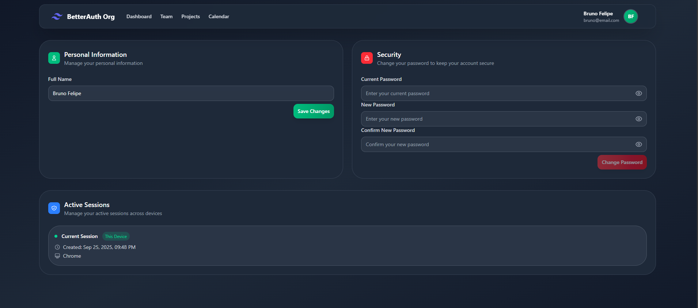
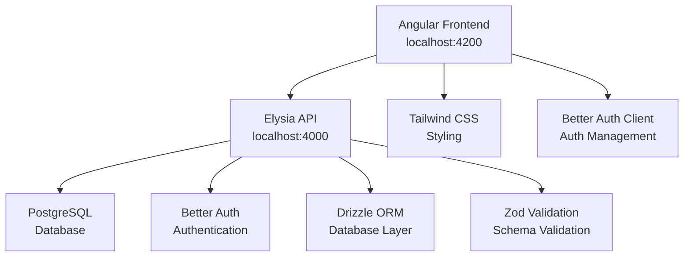

# 🚀 Better Auth Org

<div align="center">


**A modern admin panel for organizations with robust authentication**

[📸 Screenshots](#-screenshots) • [✨ Features](#-features) • [🛠️ Technologies](#️-technologies) • [🚀 Installation](#-installation) • [📖 Usage](#-usage)

</div>

---

## 📸 Screenshots

<div align="center">

### 🔐 Login Screen



### 📝 Register Screen



### 📊 Dashboard



### ⚙️ Profile Settings



</div>

---

## ✨ Features

### 🔐 **Complete Authentication**

- ✅ User login and registration
- ✅ Automatic organization creation on registration
- ✅ Session management
- ✅ Password change
- ✅ Profile updates

### 🏢 **Organization Management**

- ✅ Organization creation
- ✅ Member invitations
- ✅ Role management (admin/member)
- ✅ Member listing
- ✅ Organization data updates

### 🎨 **Modern Interface**

- ✅ Responsive design with Tailwind CSS
- ✅ Reusable components
- ✅ Elegant toast notifications
- ✅ Form validation
- ✅ Intuitive navigation

### 🛡️ **Security**

- ✅ Authentication guards
- ✅ Route protection
- ✅ Form validation
- ✅ Secure session management

---

## 🛠️ Technologies

### **Frontend**

- **Angular 20** - Main framework
- **TypeScript 5.9.2** - Programming language
- **Tailwind CSS 4.1.13** - CSS framework
- **RxJS** - Reactive programming

### **Backend API**

- **[Elysia](https://elysiajs.com/)** - Ultra-fast web framework for Bun
- **[Better Auth](https://www.better-auth.com/)** - Modern authentication system
- **[Drizzle ORM](https://orm.drizzle.team/)** - Type-safe ORM for TypeScript
- **[Bun](https://bun.sh/)** - Ultra-fast JavaScript runtime
- **PostgreSQL** - Relational database
- **[Zod](https://zod.dev/)** - TypeScript schema validation

### **Authentication**

- **Better Auth 1.3.17** - Modern authentication library
- **Organization Plugin** - Organization management

### **UI/UX**

- **ngx-sonner** - Toast notifications
- **Angular Reactive Forms** - Reactive forms
- **Angular Router** - Routing

### **Development**

- **Angular CLI 20.3.2** - Development tools
- **PostCSS** - CSS processing
- **Autoprefixer** - Browser compatibility

---

## 🔗 Backend API

This frontend project connects to a **robust backend API** built with modern technologies:

### **🚀 [Elysia Better Auth API](https://github.com/nobruf/elysia-better-auth)**

The backend is a modern and ultra-fast API built with:

- **⚡ Elysia** - Ultra-fast web framework running on Bun
- **🔐 Better Auth** - Complete authentication system
- **📊 Drizzle ORM** - Type-safe ORM with PostgreSQL
- **🛡️ Zod** - TypeScript schema validation
- **📝 OpenAPI** - Automatic documentation

### **🔌 Main Endpoints**

```typescript
// Authentication
POST   /auth/sign-up     # Create account
POST   /auth/sign-in     # Login
POST   /auth/sign-out    # Logout
GET    /auth/session     # Get current session

// Organizations
POST   /auth/organization/create     # Create organization
GET    /auth/organization/list        # List organizations
POST   /auth/organization/invite      # Invite member
GET    /auth/organization/members     # List members

// Users
GET    /users/:id        # Get user by ID
PUT    /users/:id         # Update user
```

### **⚙️ Backend Configuration**

To use this frontend, you need the backend running:

```bash
# Clone the backend repository
git clone https://github.com/nobruf/elysia-better-auth.git
cd elysia-better-auth

# Install dependencies
bun install

# Configure database
cp .env.example .env
# Edit .env with your DATABASE_URL

# Run migrations
bun run db:migrate
bun run db:auth:generate

# Start the server
bun run dev
```

The backend will be available at `http://localhost:4000` and the frontend will connect automatically.

---

## 🚀 Installation

### **Prerequisites**

- Node.js 18+
- npm or yarn
- Angular CLI 20+
- **Bun** (for backend)
- **PostgreSQL** (for database)

### **1. Configure Backend (Required)**

First, you need to configure the backend API:

```bash
# Clone the backend repository
git clone https://github.com/nobruf/elysia-better-auth.git
cd elysia-better-auth

# Install dependencies
bun install

# Configure database
cp .env.example .env
# Edit .env with your DATABASE_URL

# Run migrations
bun run db:migrate
bun run db:auth:generate

# Start the backend server
bun run dev
```

The backend will be running at `http://localhost:4000`

### **2. Clone Frontend**

```bash
git clone https://github.com/your-username/angular-better-auth-org.git
cd angular-better-auth-org
```

### **3. Install Dependencies**

```bash
npm install
```

### **4. Configure Backend Connection**

The frontend is already configured to connect to the backend at `http://localhost:4000`:

```typescript
// src/app/services/auth.service.ts
authClient = createAuthClient({
  baseURL: 'http://localhost:4000', // Elysia Backend
  basePath: '/auth',
  plugins: [organizationClient()],
});
```

### **5. Run the Project**

```bash
npm start
```

The frontend will be available at `http://localhost:4200`

---

## 🏗️ System Architecture

This project uses a **modern full-stack architecture** with clear separation between frontend and backend:



### **🔄 Data Flow**

1. **Angular Frontend** makes requests to **Elysia API**
2. **Elysia API** processes authentication with **Better Auth**
3. **Drizzle ORM** manages operations in **PostgreSQL**
4. **Responses** return to frontend via **HTTP/JSON**

### **🔐 Integrated Authentication**

- **Frontend**: Better Auth Client for session management
- **Backend**: Better Auth Server with organization plugins
- **Database**: Sessions and users stored in PostgreSQL
- **Security**: HTTPOnly cookies and JWT validation

---

## 📖 Usage

### **Project Structure**

```
src/
├── app/
│   ├── components/          # Reusable components
│   │   ├── layout/         # Layouts (header, sidebar, etc.)
│   │   └── ui/            # UI components (button, input)
│   ├── pages/             # Application pages
│   │   ├── (auth)/        # Authentication pages
│   │   └── (protect)/     # Protected pages
│   ├── services/          # Services (auth, guards)
│   └── app.routes.ts      # Route configuration
```

### **Main Features**

#### **🔐 Authentication**

```typescript
// Login
await this.authService.signIn(email, password);

// Registration with organization
await this.authService.signUpWithOrganization(email, password, name, organizationName);
```

#### **🏢 Organization Management**

```typescript
// List organizations
await this.authService.listOrganizations();

// Invite member
await this.authService.inviteUserToOrganization(
  organizationId, email, role
);

// List members
await this.authService.listMembers(organizationId, limit, offset, ...);
```

#### **👤 User Management**

```typescript
// Update profile
await this.authService.updateUser(name, image);

// Change password
await this.authService.changePassword(currentPassword, newPassword);

// Manage sessions
await this.authService.getSessions();
```

---

## 🚧 In Development

### **Planned Features**

- [ ] Advanced metrics dashboard
- [ ] Granular permission system
- [ ] External API integrations
- [ ] Reports and analytics
- [ ] Advanced organization settings
- [ ] Notification system
- [ ] File upload
- [ ] Customizable themes

### **Technical Improvements**

- [ ] Internationalization (i18n)
- [ ] Performance optimizations
- [ ] Docker containerization

---

## 🤝 Contributing

Contributions are welcome! To contribute:

1. Fork the project
2. Create a feature branch (`git checkout -b feature/AmazingFeature`)
3. Commit your changes (`git commit -m 'Add some AmazingFeature'`)
4. Push to the branch (`git push origin feature/AmazingFeature`)
5. Open a Pull Request

---

## 📄 License

This project is under the MIT License. See the [LICENSE](LICENSE) file for more details.

---

## 👨‍💻 Author

**Bruno Felipy**

- GitHub: [@nobruf](https://github.com/nobruf)
- LinkedIn: [Bruno Felipy](https://linkedin.com/in/bruno-felipy-molina)

---

<div align="center">

**⭐ If this project helped you, consider giving it a star! ⭐**

</div>
